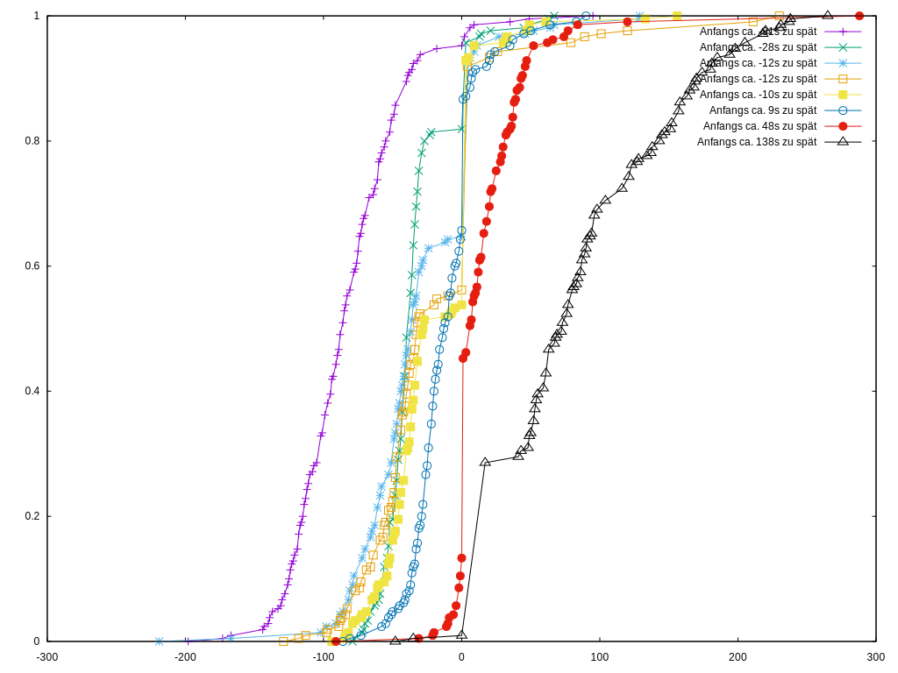
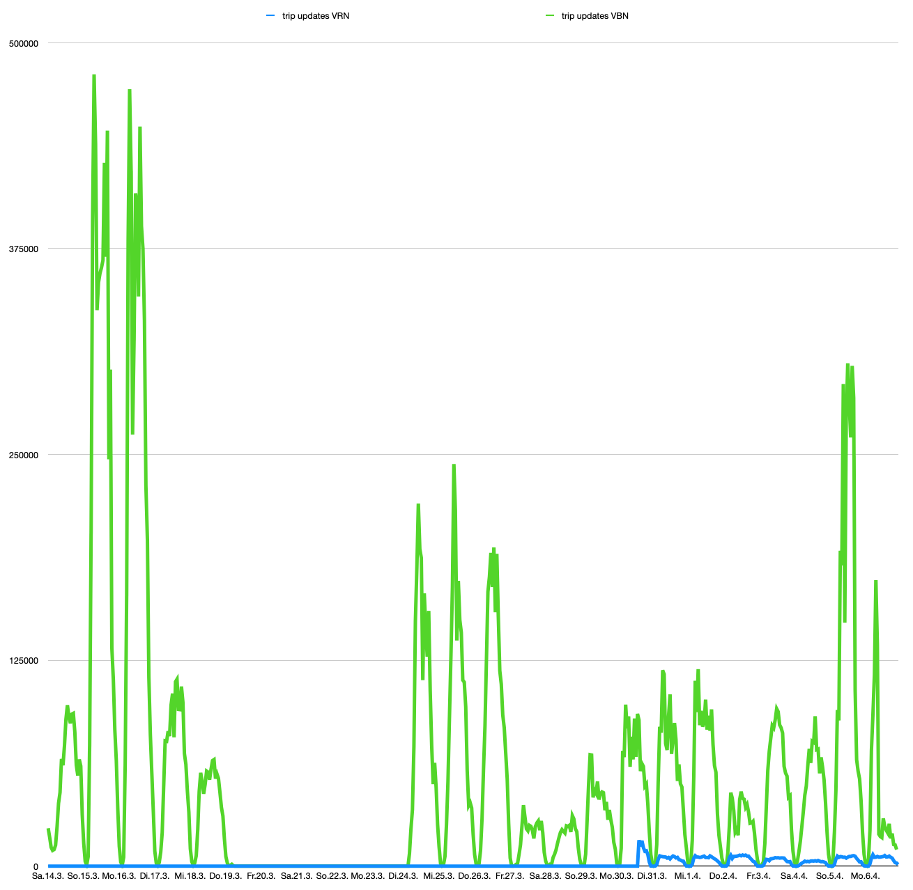
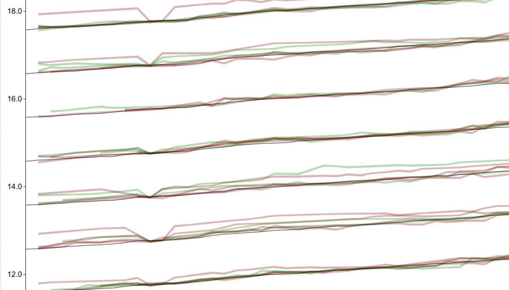

# Montagsupdates
_Im Rahmen der Projektförderung durch den [Prototype Fund](https://prototypefund.de) berichten wir wöchentlich über unseren Fortschritt, neueste Updates zuerst._

## Woche 20 (Update zum 20. Juli)
### An diesen Milestones arbeiten wir gerade
 3. [Prognose-Berechnung entwickeln](https://github.com/dystonse/dystonse/milestone/3) (Die ist jetzt im Wesentlichen fertig!)
 4. [Routensuche neu implementieren](https://github.com/dystonse/dystonse/milestone/4)
 
### Das haben wir letzte Woche gemacht
 * Unserem kleinen Server auf dem Homeoffice-Schreibtisch ein Hardware-Upgrade verpasst (SSD statt Festplatte) und das System neu installiert. Jetzt läuft darauf der aktuellste Stand unseres Docker-Compose-Stacks und sammelt Fahrplan- und Echtzeitdaten, importiert Echtzeitupdates in die Datenbank, und erstellt Prognosen für aktuelle Fahrten, basierend auf den Echtzeitupdates.
 * Community-Building und Austausch mit anderen OpenSource-Entwickler\*innen und Verkehrsunternehmen.
 * Automatische Generierung (und Speichern in der Datenbank) von [Prognosen für zukünftige Fahrten auf Basis des Fahrplans](https://github.com/dystonse/dystonse-gtfs-data/blob/master/src/importer/scheduled_predictions_importer.rs), für maximal bis zu einem festgelegten Zeitraum (aktuell testweise ca. eine Woche) in die Zukunft. Das passiert in kleinen Häppchen immer zwischendurch, wenn gerade keine neuen Echtzeitdaten zum importieren da sind.
 * [Große Refactorings in dystonse-gtfs-data](https://github.com/dystonse/dystonse-gtfs-data/commit/a1ca4c59e794194bf4c8bf657385a21ecde6f8e3), vor allem neue Datenstrukturen, um Informationen über die Qualität der Prognosen besser speichern zu können.

### Das machen wir diese Woche
 * Neuimplementierung der Routensuche anfangen
 * Planungen für Frontend (eigenes Frontend anpassen und/oder Integration in fremde Anwendungen)

### Das bremst uns gerade
 * Ablenkung durch private Aufgaben und andere Jobs.
 * Die Anforderung für unsere zweite Fördergeld-Auszahlung ist immer noch nicht angekommen.
 
### Das motiviert uns gerade
 * Endspurt :)

## Woche 19 (Update zum 13. Juli)
### An diesen Milestones arbeiten wir gerade
 3. [Prognose-Berechnung entwickeln](https://github.com/dystonse/dystonse/milestone/3)
 4. [Routensuche neu implementieren](https://github.com/dystonse/dystonse/milestone/4)
 
### Das haben wir letzte Woche gemacht
 * [Erweiterung des Import-Moduls](https://github.com/dystonse/dystonse-gtfs-data/commit/34c047745c208bb556784893a48930b62328e9e1#diff-2fd0d7be9788d256c26422411c7da3ac), so dass es Prognosen in die Datenbank speichert für alle Fahrten, von denen wir aktuelle Echtzeitdaten haben. Das Speichern ist noch etwas langsam, vor allem im Vergleich dazu wie schnell die eigentliche Berechnung passiert, aber funktioniert.
 * [Fallbacks für die Default-Prognosen](https://github.com/dystonse/dystonse-gtfs-data/commit/add94bf782c3cd64872c5ba08b4afbf112993c05#diff-333360f8a6ba23e9547ec998bca28eb5) implementiert, so dass die Abfrage auf jeden Fall immer eine Kurve zurückgeben kann - ggf. nur nach Verkehrsmittel und Ankunft/Abfahrt gruppiert, wenn für die jeweiligen Zeit- und Streckenabschnitte zu wenig Daten da sind. Und für den Fall, dass wir dann immer noch zu wenig Daten hätten, ist die [nächste Fallback-Lösung](https://github.com/dystonse/dystonse-gtfs-data/commit/becd7f5b9c91d3cce397614476e9e21fa63de5e6#diff-333360f8a6ba23e9547ec998bca28eb5) jetzt der Durchschnitt aus allen Kurven, die wir haben.
 * Das [Docker-Setup](https://github.com/dystonse/dystonse-docker/tree/with-analyser) aktualisiert, so dass einmal am Tag automatisch die Kurven (sowohl default als auch linienspezifische) neu berechnet und exportiert werden.
 * Damit sind wir nun auch sehr nah am Ziel, dass Interessierte Menschen oder Unternehmen einfach [dystonse-docker](https://github.com/dystonse/dystonse-docker/) clonen und starten können, und innerhalb von Minuten einen kompletten lauffähigen Stack erhalten. Bisher war da noch viel manuelles Tweaking nötig sowie wochenlange Datensammlung, bevor eine Datenbasis für Prognosen bestand.
 * [Caching der zuletzt geladenen Fahrplan- und Analysen-Dateien](https://github.com/dystonse/dystonse-gtfs-data/commit/f144625b3ea666623e96b46378315053d96e6d0e) in unserem Importer/Analyser/Predictor, so dass die Dateien nur noch dann neu eingelesen werden, wenn sie sich geändert haben. Das spart zwar "nur" 10 bis 20 Sekunden Rechenzeit, aber bei einem Prozess, der sich alle zwei Minuten wiederholt, kommt da schon einiges zusammen.
 * [Abhängigkeiten von `dystonse-gtfs-data`](https://github.com/dystonse/dystonse-gtfs-data/blob/master/Cargo.toml) etwas ausgemistet, d.h. einige Pakete durch leichtgewichtigere Versionen ersetzt oder in optionale Features ausgelagert, um die compile-Zeiten wieder kürzer zu machen.
 * Ein längeres Gespräch mit anderen Open-Source-Entwicklern geführt, die auch an ÖPNV-Prognosen arbeiten möchten. Vielleicht wird daraus mal eine Kooperation.
 
### Das machen wir diese Woche
 * Prognosen für alle Fahrten (nicht nur die, von denen wir Echtzeitupdates bekommen) automatisch generieren und in eine Datenbank speichern (wir testen noch, ob das mit MySQL schnell genug machbar ist, oder wir dafür z.b. auf redis umsteigen).
 * Die (vorerst) letzten Schritte, um den Einsatz unsere Docker-Stacks zu vereinfachen: Default-Analyse-Ergebnisse beilegen und Dokumentation aufräumen.
 * Die eigentliche Routensuche anfangen zu implementieren (oder zumindest planen, wie sie strukturiert sein soll).
 * Genauer planen, wie die Schnittstelle zwischen Routensuche und Analyse/Prognose aussehen soll.
 * Zweites Zwischengespräch mit der Prototypefund-Orga.
 * Gedanken dazu machen, was wir in den nächsten 7 Wochen noch erreichen können/wollen/werden, und wie es danach weiter geht.
 
### Das bremst uns gerade
 * Ablenkung durch private Aufgaben und andere Jobs
 * Langsame Hardware/langsame Datenbank
 
### Das motiviert uns gerade
 * Bald sind wir so weit, dass wir mit der Umsetzung der eigentlichen Routensuche anfangen können.
 * Nächste Woche haben wir unseren ersten Coaching-Termin.

## Woche 18 (Update zum 6. Juli)
### An diesen Milestones arbeiten wir gerade
 2. [Statistische Analyse der gesammelten Echtzeit-Verspätungs-Daten](https://github.com/dystonse/dystonse/milestone/2)
 3. [Prognose-Berechnung entwickeln](https://github.com/dystonse/dystonse/milestone/3)
 
### Das haben wir letzte Woche gemacht
 * Viel Refactoring und Erweiterungen des Import-Moduls, so dass damit auch Prognosen basierend auf aktuell eintreffenden Echtzeitdaten angefragt und in die Datenbank gespeichert werden können. Das ist noch nicht fertig.
 * Planung für eine neue Struktur der Datenbank, um aktuelle Prognosen in separaten Tabellen zu speichern.
 * Teilweise diese Planung schon in einer lokalen Testinstanz der Datenbank umgesetzt.
 * Recherche zu möglichen Erweiterungen des GTFS-Realtime-Formats, die wir verwenden oder selbst definieren könnten.

### Das machen wir diese Woche
 * Die angefangenen Erweiterungen der Datenbank und des Importer-Moduls fertig stellen.
 * Fallback-Lösungen für Prognosen definieren, für die wir keine ausreichend große Datenmenge als Grundlage haben.
 * Die automatische Erstellung von Analysen (Kurven) in unser Docker-Setup integrieren.
 * Kommunikation mit anderen OpenSource-Entwicklern aus dem Mobilitäts-OpenData-Bereich.

### Das bremst uns gerade
 * Ablenkung durch private Aufgaben und andere Jobs
 * Compilen innerhalb von Docker ist langsam, das nervt.

### Das motiviert uns gerade
 * Bald sind wir so weit, dass wir mit der Umsetzung der eigentlichen Routensuche anfangen können.

## Woche 17 (Update zum 29. Juni)
### An diesen Milestones arbeiten wir gerade
 2. [Statistische Analyse der gesammelten Echtzeit-Verspätungs-Daten](https://github.com/dystonse/dystonse/milestone/2)
 3. [Prognose-Berechnung entwickeln](https://github.com/dystonse/dystonse/milestone/3)

### Das haben wir letzte Woche gemacht
 * Die [Prognoseberechnung](https://github.com/dystonse/dystonse-gtfs-data/tree/master/src/predictor) (eigentlich keine Berechnung sondern eher ein gezieltes "Rausfischen" der passenden Wahrscheinlichkeitskurve aus der gesamten Menge, die im Voraus berechnet und gespeichert wurde) so weit fertig gestellt, dass man über die Kommandozeile eine einzelne Prognose pro Ausführung abfragen kann.
 * Einen neuen [Befehl für unser Analyse-Modul](https://github.com/dystonse/dystonse-gtfs-data/blob/master/src/analyser/curves.rs), der alle Kurven (sowohl für spezifische Linien und Haltestellen(paare), als auch die allgemeinen Kurven (nach Verkehrsmittel, Zeitraum und Streckenabschnitt)) berechnet und in einer Datei speichert, die dann vom Prognose-Modul gelesen werden kann. Das soll im laufenden Betrieb wahrscheinlich 1x täglich automatisch durchgeführt werden und dauert aktuell ca. 15 Minuten für alle Daten aus dem VBN.
 * Die [Dokumentation](https://github.com/dystonse/dystonse-gtfs-data/blob/master/README.md) mit Angaben zu den neuen Analyse- und Prognose-Befehlen erweitert.
 * Kommunikation mit anderen OpenSource-Entwicklern aus dem Mobilitäts-OpenData-Bereich.
 * Viel Arbeit am (De-)Serialisieren unserer Daten in Json, MessagePack und Ordnerstrukturen. Leider noch nicht ganz fertig, aber immerhin benutzbar.

### Das machen wir diese Woche
 * Einen Modus für das Prognose-Modul implementieren, in dem es dauerhaft läuft und jederzeit Anfragen über eine Schnittstelle beantworten kann.
 * Vorher erst noch die Schnittstelle für diese Prognose-Anfragen genauer planen und definieren.

### Das bremst uns gerade
 * Die Hitze im (Dachgeschoss-)Arbeitszimmer (inzwischen geht's erstmal wieder)
 * Ablenkung durch private Aufgaben und andere Jobs

### Das motiviert uns gerade
 * Bald sind wir so weit, dass wir mit der Umsetzung der eigentlichen Routensuche anfangen können.
 

## Woche 16 (Update zum 22. Juni)
### An diesen Milestones arbeiten wir gerade
 2. [Statistische Analyse der gesammelten Echtzeit-Verspätungs-Daten](https://github.com/dystonse/dystonse/milestone/2)
 3. [Prognose-Berechnung entwickeln](https://github.com/dystonse/dystonse/milestone/3)

### Das haben wir letzte Woche gemacht
 * Die größte Aufräumaktion, die unser Code bisher gesehen hat. Es lässt sich nicht klar von den neuen Features trennen, aber allein `dystonse-gtfs-data` hatte in dieser Woche `22 files changed, 1705 insertions(+), 2078 deletions(-)`.
 * Unterteilung der Daten und Analysen nach Wochentag und Uhrzeit in [11 disjunkte `TimeSlots`](https://github.com/dystonse/dystonse-gtfs-data/blob/master/src/types/time_slots.rs) die dem [Wikipedia-Beispiel der Verkehrszeiten in Bottrop](https://de.wikipedia.org/wiki/Verkehrszeiten#Beispiele) nachempfunden sind.
 * [Allgemeinere Statistiken über Verspätungen](https://github.com/dystonse/dystonse-gtfs-data/blob/master/src/analyser/default_curves.rs), gruppiert u.a. nach Verkehrsmittel-Typ, damit wir auch für die vielen Linien Prognosen erstellen können, für die wir gar keine Echtzeitdaten haben. Dabei betrachten wir Anfang, Mitte und Ende jeder Linie gesondert, nachdem [David Kriesel in seinem Vortrag zum 'BahnMining'](http://www.dkriesel.com/blog/2019/1229_video_und_folien_meines_36c3-vortrags_bahnmining) heraus gestellt hat, wie verschieden sich Verspätungen da auswirken
 * Die Analyse der Verspätungen und das Erzeugen der Grafiken sind nun sauber getrennt. Dabei funktioniert die Analyse immer noch, die Grafikerzeugung ist momentan nicht ganz einsatzbereit.
 * Die Analysen können jetzt in eine große maschinenlesbare Datei (MessagePack) oder Ordnerstrukturen mit sehr vielen (!) Dateien (MessagePack oder JSON) geschrieben werden. Dabei sind diverse Zwischenstufen konfigurierbar.
 * Das [Grundgerüst für die Erstellung von Prognosen](https://github.com/dystonse/dystonse-gtfs-data/blob/master/src/predictor/mod.rs) steht nun.

### Das machen wir diese Woche
 * Prognosen! In dieser Woche sollen endlich erste eigene Prognosen entstehen. Dazu feht gar nicht mehr so viel Code.
 * Die Erstellung der Prognosen muss aber auch in ein größeres Framework mit API, Caching, etc. eingebunden werden. Da müssen wir noch viel planen.
 * Es fehlt noch etwas Code, um die Analyse-Daten wieder einzulesen, wenn diese nicht in einer einzelnen Datei sondern einer Ordnerhierarchie vorliegen.
 * Unter anderem durch unseren [Blogpost vom 10.6.](http://blog.dystonse.org/analysis/2020/06/10/kurven.html) haben uns ein paar Zuschriften von Verkehrsverbünden, Unternehmen und anderen OpenSource-Teams erreicht. Die wollen wir nun angemessen beantworten und schauen, welche Arten der Kooperation da möglich sind.
 * Uns um Coaching-Termine kümmern.
 
### Das bremst uns gerade
 * Das gute Wetter und die knapp 30°C in unserem Arbeitszimmer

### Das motiviert uns gerade
 * Das gute Wetter
 * Dass wir bald eine neue Auszahlung beantragen können :)
 * Dass nur noch etwa 2 Monate verbleiben - das ist allerdings gleichermaßen motivierend und beängstigend, da noch so viel zu tun ist

## Woche 15 (Update zum 15. Juni)
### An diesen Milestones arbeiten wir gerade
 2. [Statistische Analyse der gesammelten Echtzeit-Verspätungs-Daten](https://github.com/dystonse/dystonse/milestone/2)
 3. [Prognose-Berechnung entwickeln](https://github.com/dystonse/dystonse/milestone/3)

### Das haben wir letzte Woche gemacht
 * Einen sehr ausführlichen [Blogpost über unsere statistischen Auswertungen](http://blog.dystonse.org/analysis/2020/06/10/kurven.html) geschrieben
 * Viele Detailverbesserungen an den grafischen Darstellungen gemacht und dabei viel über [Gnuplot](http://www.gnuplot.info/) gelernt
 * Eine Metrik erdacht und implementiert, mit der sich die Unterschiedlichkeit mehrerer Wahrscheinlichkeitsverteilungen als Wert ausdrücken lässt
 * Recherche zur Datenserialisierung mit Rust, um unsere Analysen maschinenlesbar zu speichern
 * Überlegungen zu verschiedenen Prognoseverfahren je nach Verfügbarkeit von Echtzeitdaten. Dabei haben wir unser Projekt nochmal auf vielen verschiedenen Detail-Leveln betrachtet und unsere Planung für die nächsten Wochen angepasst.

### Das machen wir diese Woche
 * Code aufräumen. In [dystonse-gtfs-data](https://github.com/dystonse/dystonse-gtfs-data) ist der Code zur Datenverarbeitung und zur grafischen Darstellung noch viel zu stark vermischt.
 * Implementierung der oben genannten Datenserialisierung mit [Serde](https://serde.rs/) / [MessagePack](https://msgpack.org/) oder [Protocol Buffers](https://developers.google.com/protocol-buffers)
 * Evtl. bereits erste Version einer einfachen Prognosekomponente, die auf den Analysen aufbaut (wie schon eine Woche zuvor gehofft).
 * Statistische Gesamtauswertungen mit vereinfachten Parametern (z.B. für alle Busse / alle Straßenbahnen, etc.), um ein Fallback für die (vielen!) Linien zu bieten, für die wir grundsätzlich keine Echtzeitdaten haben. Damit könnten wir auch schon die Neuimplementierung der Routensuche angehen.
 
### Das bremst uns gerade
 * Oft verzetteln wir uns in aufwändigen Lösungen für Detailprobleme und verlieren dabei das große Ganze etwas aus den Augen. Diese Lösungen fühlen sich dann zwar für den Moment wie ein wichtiger Erfolg an, aber bremsen ums im Gesamtverlauf.

### Das motiviert uns gerade
 * Der Blogpost wurde ganz gut geteilt und wir haben viel positives Feedback dafür und ein paar neue Kontakte dadurch bekommen.
 * Die Reflektion zur Zielsetzung und den nun nötigen Schritten wirft ein paar spannende, neue Aufgaben auf, die wir gerne angehen wollen.

## Woche 14 (Update zum 8. Juni)
### An diesen Milestones arbeiten wir gerade
 2. [Statistische Analyse der gesammelten Echtzeit-Verspätungs-Daten](https://github.com/dystonse/dystonse/milestone/2)
 3. [Prognose-Berechnung entwickeln](https://github.com/dystonse/dystonse/milestone/3)

### Das haben wir letzte Woche gemacht
 * Viel Arbeit an den statistischen Auswertungen und ihrer Visualisierung, darunter:
   * Rundungs-Artefakte in den Rohdaten gefunden und einen Workaround dafür gefunden
   * Bessere Aufteilung der Rohdaten in Klassen von Anfangsverspätungen
   * Datenpunkte werden nicht mehr strikt in eine dieser Klassen zugeteilt, sondern gehen gewichtet in (bis zu) zwei benachbarte Klassen ein
   * Grafische Verbesserungen wie z.B. bessere Farbauswahl, verständlichere Legende, etc.
 * Durchschauen der generierten Kurven und manuelle Prüfung auf Plausibilität. Unter anderem haben wir aus charakteristischen Mustern in den Kurven das Vorhandensein einer Ampel direkt vor einer Bushaltestelle vorhergesagt und anschließend mit Satellitenbildern bestätigt.
 * Kleine [Ergänzung](https://github.com/rust-transit/gtfs-structure/pull/66) am GTFS-Parser.
 * Vorbereitung eines neuen Blogposts, der die Arbeit(-sergebnisse) der letzten zwei Wochen beschreibt. Dieser ist leider nicht mehr vor dem heutigen Update fertig geworden.

### Das machen wir diese Woche
 * Den Blogpost fertig stellen. Dazu fehlt noch eine ganze Menge Text, aber auch kleine Anpassungen an unserer Software um erklärende Grafiken zu generieren.
 * Ausweitung unserer Analysen auf alle gesammelten Linien - bisher haben wir nur zwei Bus- und zwei Tramlinien aus Bremen und Oldenburg betrachtet.
 * Evtl. bereits erste Version einer einfachen Prognosekomponente, die auf den Analysen aufbaut.
 
### Das bremst uns gerade
 * Das Übliche :/

### Das motiviert uns gerade
 * Die Kurven bildlich zu sehen bestätigt weiterhin viele zuvor ungeprüfte Annahmen über die Daten bzw. das Wesen von Verspätungen allgemein.
 * Bei den statistischen Methoden verlassen wir eigentlich deutlich unsere Comfort Zone - also den Bereich dessen, wo wir uns fachlich sicher fühlen - und trotzdem geht es damit sehr reibungslos voran.

## Woche 13 (Update zum ~~1.~~ 2. Juni)
### An diesen Milestones arbeiten wir gerade
 1. [Kontinuierliche Verspätungs-Datensammlung planen, aufbauen und betreiben](https://github.com/dystonse/dystonse/milestone/1) (ab jetzt hauptsächlich nur noch der "betreiben"-Anteil)
 2. [Statistische Analyse der gesammelten Echtzeit-Verspätungs-Daten](https://github.com/dystonse/dystonse/milestone/2)
 3. [Prognose-Berechnung entwickeln](https://github.com/dystonse/dystonse/milestone/3)
 
 ### Das haben wir letzte Woche gemacht 
 * Verschiedene Detailverbesserungen an den [Kurven](https://github.com/dystonse/dystonse-curves)-Strukturen.
 * Die Kurven um neue Funktionalität ergänzt: Gewichtete Interpolation zwischen mehreren Kurven.
 * Code in [dystonse-gtfs-data](https://github.com/dystonse/dystonse-gtfs-data) aufgeräumt / umstrukturiert für mehr Übersichtlichkeit.
 * **Erste statistische Analysen der gesammelten Verspätungsdaten unter Verwendung der Kurven. Das ist ein riesiger, ganz zentraler Meilenstein, der sehr bald seinen eigenen Blogpost zur Erläuterung verdient!**

Im Folgengen ein kleines Beispiel für die Analysen.

Zu sehen ist die Straßenbahnlinie 1 in Bremen. Auf der X-Achse ist ihre Verspätung an der Endhaltestelle in Sekunden aufgetragen, und die Y-Achse zeigt die Wahrscheinlichkeit, dass die Bahn höchsten so viel verspätet ist. Alle Daten (einige Tausend Echtzeitaufzeichnungen) wurden danach gruppiert, wie viel verspätung die selbe Bahn zwei Haltestellen zuvor hatte, und für jede solche Gruppe eine Kurve erzeugt.

Unsere Software erstellt eine solche Grafik durchschnittlich innerhalb von 85ms, inkl. des Einlesens des Fahrplans und der Abfrage der Daten aus der Datenbank.
 
 ### Das machen wir diese Woche
 * Weitere Funktionen für die Prognoseberechnung mit den neuen Kurven
 * Möglichkeit, die Daten in nicht-grafischer Form abzuspeichern
 * Blogpost über die Bedeutung dieser Kurven, also was sie darstellen und warum sie so zentral für unser Projekt sind 
 
 ### Das bremst uns gerade
 * Andere Jobs und private Aufgaben
 * Schlechte Stimmung wegen der allgemeinen Lage auf der Welt
 
 ### Das motiviert uns gerade
 * Wir arbeiten endlich an einem wichtigen Kernstück unseres Projekts, bei dem wir mit den gesammelten Daten tatsächlich etwas nützliches anfangen können.
 * Lenas anderer Job ist jetzt zu Ende - das heißt mehr Zeit und Energie für dieses Projekt.

## Woche 12 (Update zum 25. Mai)
### An diesen Milestones arbeiten wir gerade
 1. [Kontinuierliche Verspätungs-Datensammlung planen, aufbauen und betreiben](https://github.com/dystonse/dystonse/milestone/1) (ab jetzt hauptsächlich nur noch der "betreiben"-Anteil)
 2. [Statistische Analyse der gesammelten Echtzeit-Verspätungs-Daten](https://github.com/dystonse/dystonse/milestone/2)
 3. [Prognose-Berechnung entwickeln](https://github.com/dystonse/dystonse/milestone/3) 
 
 ### Das haben wir letzte Woche gemacht 
 * Datenstrukturen für ein zentrales Konzept unseres Projekts in Programmcode umgesetzt: [Kurven](https://github.com/dystonse/dystonse-curves) für die kumulierte Wahrscheinlichkeit in verschiedenen Varianten.
 * Grafische Darstellung der Kurven mit [gnuplot](https://docs.rs/gnuplot/0.0.36/gnuplot/) ausprobiert und als Beispiele in unseren Code eingebaut.
 
 ### Das machen wir diese Woche
 * Die Kurven-Datenstrukturen und ihre grafische Darstellung um weitere Funktionen ergänzen.
 * Ausprobieren, wie wir die Berechnungen auf den Kurven mit den gesammelten Daten aus der Datenbank verknüpfen können, um daraus die Prognosen zu generieren.
 
 ### Das bremst uns gerade
 * Private Angelegenheiten hier zuhause sind gerade immer noch stressig.
 
 ### Das motiviert uns gerade
 * Mit den Kurven haben wir einen neuen Abschnitt unseres Projekts in Angriff genommen, an dem wir jetzt direkt neue Fortschritte sehen können.

## Woche 11 (Update zum 18. Mai)
### An diesen Milestones arbeiten wir gerade
 1. [Kontinuierliche Verspätungs-Datensammlung planen, aufbauen und betreiben](https://github.com/dystonse/dystonse/milestone/1) (ab jetzt hauptsächlich nur noch der "betreiben"-Anteil)
 2. [Statistische Analyse der gesammelten Echtzeit-Verspätungs-Daten](https://github.com/dystonse/dystonse/milestone/2)
 3. [Prognose-Berechnung entwickeln](https://github.com/dystonse/dystonse/milestone/3)
 
 ### Das haben wir letzte Woche gemacht 
 * Anpassung des Analysetools an das neue Datenbankschema fertiggestellt.
 * [Readme-Datei unseres Haupt-Repos](https://github.com/dystonse/dystonse/blob/master/README.md) aktualisiert mit Links zu den neuen Projekt-Repos und Infos, woran wir gerade arbeiten.
 * Monitoring unserer Datensammlung verbessert.
 
 ### Das machen wir diese Woche
 * Analysetool erweitern
 * Hoffentlich mit der Prognoseberechnung anfangen
 
 ### Das bremst uns gerade
 * Wir waren letzte Woche beide etwas krank und haben daher nicht viel geschafft.
 * Private Angelegenheiten hier zuhause sind gerade immer noch stressig.
 
 ### Das motiviert uns gerade
 * Dadurch, dass die Datenbank jetzt schnell läuft, können wir viel mehr mit den Daten anfangen und haben weniger nervige Wartezeiten.

## Woche 10 (Update zum 11. Mai)
### An diesen Milestones arbeiten wir gerade
 1. [Kontinuierliche Verspätungs-Datensammlung planen, aufbauen und betreiben](https://github.com/dystonse/dystonse/milestone/1) (ab jetzt hauptsächlich nur noch der "betreiben"-Anteil)
 2. [Statistische Analyse der gesammelten Echtzeit-Verspätungs-Daten](https://github.com/dystonse/dystonse/milestone/2)
 3. [Prognose-Berechnung entwickeln](https://github.com/dystonse/dystonse/milestone/3)
 
 ### Das haben wir letzte Woche gemacht 
 * Den Datenbankserver um eine SSD erweitert.
 * [Datenbankschema umgestellt](https://github.com/dystonse/dystonse-docker/commit/94dbb56b310636ca1f30b2016aed540d8656a1c8), so dass wir weniger Speicherplatz brauchen. Jetzt passt unsere gesamte Datenbank in den Cache. Dadurch, und durch einen anderen Primärindex, sind unsere Abfragen darauf nun wieder sehr viel schneller.
 * [Importer an das neue Schema angepasst](https://github.com/dystonse/dystonse-gtfs-data/commit/dd1cf85c6b4836d8703230016807f8954966c0a8).
 * Alle Daten neu importiert.
 * Vorgespräch zum Coaching.
 
 ### Das machen wir diese Woche
 * Analysetool (das derzeit Bildfahrpläne generiert) an das neue Schema anpassen (bereits angefangen).
 * Weitere Analysefunktionen implementieren (gemäß der Planungen der letzten zwei Wochen).
 
 ### Das bremst uns gerade
 * Private Angelegenheiten brauchen gerade viel Energie.
 
 ### Das motiviert uns gerade
 * Lena hat ihren anderen Job verloren und deshalb ab Juni mehr Zeit und vor allem mehr Konzentration für Dystonse. (Klingt komisch, ist aber wirklich völlig ok so.)
 

## Woche 9 (Update zum 4. Mai)
### An diesen Milestones arbeiten wir gerade
 1. [Kontinuierliche Verspätungs-Datensammlung planen, aufbauen und betreiben](https://github.com/dystonse/dystonse/milestone/1) (ab jetzt hauptsächlich nur noch der "betreiben"-Anteil)
 2. [Statistische Analyse der gesammelten Echtzeit-Verspätungs-Daten](https://github.com/dystonse/dystonse/milestone/2)
 3. [Prognose-Berechnung entwickeln](https://github.com/dystonse/dystonse/milestone/3)
 
 ### Das haben wir letzte Woche gemacht 
 * Ein mathematisches Konzept für die komprimierte Speicherung der gesammelten Verspätungsdaten entwickelt, um Speicherplatz zu sparen und schnelle Zugriffe zu ermöglichen.
 * Verschiedene organisatorische Dinge
 
 ### Das machen wir diese Woche
 * Recherche zu Server-Angeboten, um unsere Infrastruktur langfristig außerhalb unseres Home Office betreiben zu können
 * Bisherigen Code etwas aufräumen
 * Komprimiertes Speicherkonzept in Programmcode umsetzen
 * Weitere manuelle / grafische Analysen unserer gesammelten Daten
 
 ### Das bremst uns gerade
 * Wir sind allgemein etwas erschöpft und haben letzte Woche nicht viel geschafft
 
 ### Das motiviert uns gerade
 * Die erste Auszahlung von unserem Fördergeld ist inzwischen angekommen
 * Bald fängt unser erstes Coaching an
 

## Woche 8 (Update zum 27. April)
### An diesen Milestones arbeiten wir gerade
 1. [Kontinuierliche Verspätungs-Datensammlung planen, aufbauen und betreiben](https://github.com/dystonse/dystonse/milestone/1) (ab jetzt hauptsächlich nur noch der "betreiben"-Anteil)
 2. [Statistische Analyse der gesammelten Echtzeit-Verspätungs-Daten](https://github.com/dystonse/dystonse/milestone/2)
 3. [Prognose-Berechnung entwickeln](https://github.com/dystonse/dystonse/milestone/3)
 
### Das haben wir letzte Woche gemacht 
 * Infos über asynchrone Funktionen in Rust recherchiert, um rauszufinden, ob wir damit unsere Berechnungen evtl. beschleunigen können.
 * [Diagramme](https://twitter.com/dystonse/status/1253389857935757318) erstellt, um zu visualisieren, wie sich die Verspätung eines Busses zwischen verschiedenen Haltestellen verändert - dabei haben wir leider einige unplausible Auffälligkeiten in den Daten bemerkt.
 * Diverse organisatorische Aufgaben im Rahmen unserer Förderung.
 
### Das machen wir diese Woche
 * Planung, Recherche und Überlegung, wie wir mit den bisherigen Daten besser arbeiten können und/oder weitere Datenquellen suchen.
 * Umsetzung davon, je nachdem was dabei rauskommt.
 * Datenstrukturen für die Prognose-Komponente definieren.
 * Weitere organisatorische Aufgaben nachholen, die zwischendurch liegen geblieben sind.

### Das bremst uns gerade
 * Andere Jobs und private Aufgaben
 * Die Arbeit mit der Datenbank und den fehlerhaften Daten ist oft frustrierend.
 * Unser erstes Fördergeld ist immer noch nicht angekommen und wir werden langsam nervös, ob wir mit dem Geld von unseren anderen Jobs alleine noch finanziell über den Monatswechsel kommen.

### Das motiviert uns gerade
 * Home Office zu zweit funktioniert immer noch gut.
 * Bald kommen wieder spannende Programmieraufgaben auf uns zu.

## Woche 7 (Update zum 20. April)
### An diesen Milestones arbeiten wir gerade
 1. [Kontinuierliche Verspätungs-Datensammlung planen, aufbauen und betreiben](https://github.com/dystonse/dystonse/milestone/1) (ab jetzt hauptsächlich nur noch der "betreiben"-Anteil)
 2. [Statistische Analyse der gesammelten Echtzeit-Verspätungs-Daten](https://github.com/dystonse/dystonse/milestone/2)
 3. [Prognose-Berechnung entwickeln](https://github.com/dystonse/dystonse/milestone/3)
 
### Das haben wir letzte Woche gemacht 
 * Die Generierung von Bildfahrplänen verbessert.
 * Datenbank-Indizes verbessert (und dabei viel ausprobiert und gelernt), damit die Abfragen auf unserer großen Datenmenge trotzdem noch in brauchbarer Zeit fertig werden.
 * Einen ausführlichen [Blogpost](http://blog.dystonse.org/opendata/2020/04/20/datensammlung-2.html) über unsere Fortschritte des letzten Monats vorbereitet.
 
### Das machen wir diese Woche
 * Die Datenbank weiter verbessern (vor allem: beschleunigen), ggf. neu aufsetzen falls nötig.
 * Datenanalysen nicht nur "mit den Augen" durch Bildfahrpläne, sondern als statistische Zahlenwerte.

### Das bremst uns gerade
 * Andere Jobs und private Aufgaben
 * Viele unserer Datensätze wirken trotz insgesamt großer Mengen noch so lückenhaft, dass wir möglicherweise bald noch weitere Quellen suchen müssen, deren Daten weniger fehlerhaft sind (aber dafür dann wahrscheinlich noch nicht so _richtig_ Open Data).
 
### Das motiviert uns gerade
 * Die erste Auszahlung unseres Fördergeldes kommt wahrscheinlich bald bei uns an.
 
## Woche 6 (Update zum ~~13.~~ 14. April)
### An diesen Milestones arbeiten wir gerade
 1. [Kontinuierliche Verspätungs-Datensammlung planen, aufbauen und betreiben](https://github.com/dystonse/dystonse/milestone/1) (ab jetzt hauptsächlich nur noch der "betreiben"-Anteil)
 2. [Statistische Analyse der gesammelten Echtzeit-Verspätungs-Daten](https://github.com/dystonse/dystonse/milestone/2)
 3. [Prognose-Berechnung entwickeln](https://github.com/dystonse/dystonse/milestone/3)

### Das haben wir letzte Woche gemacht
(wie immer: viel Text, aber diesmal auch ein paar Bilder!)

 * Einfache, quantitative Visualisierungen der bisher gesammelten Daten, um die Menge und Qualität der Daten einzuschätzen (schwankt leider sehr).
 * Versuch, die verschiedenen Varianten von (Bus-)Linien zu verstehen und algorithmisch zu verarbeiten. Dabei entstehen unhandliche Grafiken wie die folgende: [haltestellen_03.png](img/haltestellen_03.png).
 * Visualisierung von einzelnen (Sub)Routen in Raum-Zeit-Diagrammen im Stil von [Bildfahrplänen](https://de.wikipedia.org/wiki/Bildfahrplan) als neue Funktion unseres [dystonse-gtfs-data](https://github.com/dystonse/dystonse-gtfs-data)-Tools implementiert. Beispiel siehe unten.
 * Die Datenstrukturen für `Trip`s im Paket [gtfs-structures](https://github.com/rust-transit/gtfs-structure) um ein Feld für die optionale `shape_id` aus dem GTFS-Standard erweitert, die wir auch für unsere Visualisierung nutzen, und dafür einen Pull request erstellt.
 * In unserer Version der [gtfs-structures](https://github.com/dystonse/gtfs-structure) ein neues Feld `route_variant` eingeführt, dessen Wert aus der Haltestellen-Abfolge berechnet wird (damit weichen wir zwar vom GTFS-Standard ab, aber es ist zuverlässiger, da die optionale `shape_id` von einem der Anbieter, die wir aktuell verwenden, oft nicht angegeben wird.)
 * Ein neues [Repository für manuelle Tests](https://github.com/dystonse/dystonse-tests) angelegt, um für "mal eben schnell gucken, ob die Daten jetzt richtig aussehen" weniger in unserem eigentlichen Code rumbasteln zu müssen.

### Bilder
Die Menge der Datenpunkte, die wir pro Stunde sammeln konnten. Der blaue Graph zeigt Daten aus dem _VRN (Verkehrsverbund Rhein Neckar)_ und der grüne aus dem _VBN (Verkehrsverbund Bremen Niedersachsen)_.

Hier ein Beispiel für einen von uns generierten Bildfahrplan:

Auf der Y-Achse schreitet von unten nach oben die Zeit voran, hier also von etwa 12:00 bis 18:00. Von links nach rechts verläuft die Buslinie 430 in Oldenburg. Die Bedeutung der Linien je nach Farbe:

 * **schwarz:** Der Verlauf laut Fahrplan
 * **grün:** Reale Fahrten an einem Wochentag
 * **rot:** Reale Fahrten an einem Sonntag

### Das machen wir diese Woche
 * Datenqualität sichten und prüfen, ob wir systematische Fehler beim Sammeln / Import gemacht haben
 * ggf. Fehler beheben und neu importieren
 * weitere Analyse der Echtzeitdaten, auf dass wir bald zu einem statistischen Modell für die Prognose kommen
 * ggf. neuer Blog-Post zu unseren Erkenntnissen und Zwischenergebnissen
 
### Das bremst uns gerade
 * Andere Jobs und private Aufgaben
 * die ungewisse Zukunft (Absage vieler Veranstaltungen etc. durch die Corona-Krise) drückt mittlerweile schon etwas auf unsere Stimmung und Energie

### Das motiviert uns gerade
 * Mit der Visualisierung der Daten haben wir direkt etwas sichtbares als Ergebnis.

## Woche 5 (Update zum 6. April)
### An diesen Milestones arbeiten wir gerade
 1. [Kontinuierliche Verspätungs-Datensammlung planen, aufbauen und betreiben](https://github.com/dystonse/dystonse/milestone/1) (ab jetzt hauptsächlich nur noch der "betreiben"-Anteil)
 2. [Statistische Analyse der gesammelten Echtzeit-Verspätungs-Daten](https://github.com/dystonse/dystonse/milestone/2)
 3. [Prognose-Berechnung entwickeln](https://github.com/dystonse/dystonse/milestone/3)

### Das haben wir letzte Woche gemacht
 * Fehlerbehandlung und Ausgabe von Erfolgsstatistiken im [Importer](https://github.com/dystonse/dystonse-gtfs-importer) verbessert.
 * Datensammlung und -import für eine weitere Datenquelle eingerichtet, so dass wir nun Daten von [VBN](https://www.vbn.de/) und [VRN](https://www.vrn.de/) gleichzeitig aufzeichnen.
 * Früher gesammelte Daten (von unserem ersten Testserver) zusätzlich in die aktuell genutzte Datenbank importiert.

### Das machen wir diese Woche
 * Erste statistische Analysen der bisher gesammelten Daten, um ein Gefühl dafür zu bekommen, mit welchen Einflussfaktoren wir beim Prognose-Modul anfangen.
 * Mit der Entwicklung der Software-Komponente für die Prognoseberechnung beginnen.
 
### Das bremst uns gerade
 * Nachdem wir im vorigen Monat recht viel Zeit in dieses Projekt gesteckt hatten, haben wir uns letzte Woche etwas mehr Zeit für Erholung genommen und uns mehr um private Angelegenheiten gekümmert.

### Das motiviert uns gerade
 * Programmieren in Rust macht Spaß
 * Wir haben unsere erste wichtige Komponente im Wesentlichen fertig und können jetzt bald mit ganz neuen Teilen anfangen

## Woche 4 (Update zum 30. März)
### An diesen Milestones arbeiten wir gerade
 1. [Kontinuierliche Verspätungs-Datensammlung planen, aufbauen und betreiben](https://github.com/dystonse/dystonse/milestone/1)
 2. [Statistische Analyse der gesammelten Echtzeit-Verspätungs-Daten](https://github.com/dystonse/dystonse/milestone/2)

### Das haben wir letzte Woche gemacht
 * Datensammlungs-Skripte und Importer in [Docker-Setup](https://github.com/dystonse/dystonse-docker) integriert
 * [Importer](https://github.com/dystonse/dystonse-gtfs-importer) so erweitert, dass mehrere Dateien auf einmal verarbeitet werden können.
 * Anschließend automatischen Modus hinzugefügt, mit dem kontinuierlich neue Daten erkannt und in die Datenbank importiert werden.

### Das machen wir diese Woche
 * Datensammlung robuster machen (Fehlerbehandlung, Monitoring, etc.)
 * Analyse der bisher gesammelten Daten (zunächst Datenqualität und -Menge, dann Statistik über Verspätungen)
 * Anlegen von neuen Datenquellen automatisieren 
 * evtl. mit der Entwicklung der Software-Komponente für die Prognoseberechnung beginnen
 
### Das bremst uns gerade
 * Durch das Corona-Virus ist Nahverkehr gerade kein besonders populäres Thema, was z.B. Nutzer\*innen-Befragungen schwierig machen könnte
 * andere Jobs und Verpflichtungen

### Das motiviert uns gerade
 * Dass wir zwei gemeinsam im selben Homeoffice arbeiten können (das sogenannte "Social Dystonsing" 😉)

## Woche 3 (Update zum 23. März)
### An diesen Milestones arbeiten wir gerade
 1. [Kontinuierliche Verspätungs-Datensammlung planen, aufbauen und betreiben](https://github.com/dystonse/dystonse/milestone/1)
 2. [Statistische Analyse der gesammelten Echtzeit-Verspätungs-Daten](https://github.com/dystonse/dystonse/milestone/2)
 3. [Prognose-Berechnung entwickeln](https://github.com/dystonse/dystonse/milestone/3)

### Das haben wir letzte Woche gemacht
 * Langzeitarchivierung von Fahrplandaten in git getestet - geht nur so mäßig, daher erstmal verworfen
 * MacMini mit Debian und Docker eingerichtet, um Raspberry Pi zu ersetzen/ergänzen
 * [docker-compose-Konfiguration](https://github.com/dystonse/dystonse-docker) für Datenbank(-administration) aufgesetzt
 * Angefangen, die Programmiersprache Rust zu lernen
 * [Importer](https://github.com/dystonse/docker-rust-test) in Rust geschrieben, der folgendes tut:
   * Fahrplandaten (aus gtfs) einlesen. Wir haben das auf drei verschiedene Weisen getestet:
     * zunächst mit [`gtfsdb`](https://github.com/OpenTransitTools/gtfsdb) (sehr langsam)
     * dann mit [`gtfs-structures`](https://github.com/rust-transit/gtfs-structure) (133 mal schneller als `gtfsdb`)
     * [`csv`](https://crates.io/crates/csv) selbst parsen (weitere 30 mal schneller als `gtfs-structures`, aber unpraktisch, daher verworfen)
   * Echtzeitdaten (aus gtfs-realtime) einlesen
   * Daten miteinander referenzieren
   * Daten in Datenbank schreiben
 * Definiert und [Notizen](Notizen%20zur%20Prognoseberechnung.md) dazu gemacht, was die Ein- und Ausgabeparameter der Prognose sind

### Das machen wir diese Woche
 * Analyse der bisher gesammelten Daten
 * Software-Komponente für die Prognoseberechnung entwickeln
 * mehr Rust lernen
 
### Das bremst uns gerade
 * Im Zuge der Covid-19-Prävention wurden große Teile des Nahverkehrs eingestellt, dadurch bekommen wir praktisch keine Echzeitdaten mehr. Zum Glück haben wir einige Tage zuvor mit der Aufzeichnung begonnen
 * Das Cross-Compiling mit `docker buildx` schlägt nun [wegen eines bekannten Bugs](https://github.com/dystonse/docker-rust-test#known-problems-with-cross-compiling) fehl, für den es noch keine verfügare Lösung gibt

### Das motiviert uns gerade
 * Rust ist eine spannende Sprache, und sich darin einzuarbeiten ist anspruchsvoll, aber eben auch motivierend

## Woche 3 (Update zum 23. März)
### An diesen Milestones arbeiten wir gerade
 1. [Kontinuierliche Verspätungs-Datensammlung planen, aufbauen und betreiben](https://github.com/dystonse/dystonse/milestone/1)
 2. [Statistische Analyse der gesammelten Echtzeit-Verspätungs-Daten](https://github.com/dystonse/dystonse/milestone/2)
 3. [Prognose-Berechnung entwickeln](https://github.com/dystonse/dystonse/milestone/3)

### Das haben wir letzte Woche gemacht
 * Langzeitarchivierung von Fahrplandaten in git getestet - geht nur so mäßig, daher erstmal verworfen
 * MacMini mit Debian und Docker eingerichtet, um Raspberry Pi zu ersetzen/ergänzen
 * [docker-compose-Konfiguration](https://github.com/dystonse/dystonse-docker) für Datenbank(-administration) aufgesetzt
 * Angefangen, die Programmiersprache Rust zu lernen
 * [Importer](https://github.com/dystonse/docker-rust-test) in Rust geschrieben, der folgendes tut:
   * Fahrplandaten (aus gtfs) einlesen. Wir haben das auf drei verschiedene Weisen getestet:
     * zunächst mit [`gtfsdb`](https://github.com/OpenTransitTools/gtfsdb) (sehr langsam)
     * dann mit [`gtfs-structures`](https://github.com/rust-transit/gtfs-structure) (133 mal schneller als `gtfsdb`)
     * [`csv`](https://crates.io/crates/csv) selbst parsen (weitere 30 mal schneller als `gtfs-structures`, aber unpraktisch, daher verworfen)
   * Echtzeitdaten (aus gtfs-realtime) einlesen
   * Daten miteinander referenzieren
   * Daten in Datenbank schreiben
 * Definiert und [Notizen](Notizen%20zur%20Prognoseberechnung.md) dazu gemacht, was die Ein- und Ausgabeparameter der Prognose sind

### Das machen wir diese Woche
 * Analyse der bisher gesammelten Daten
 * Software-Komponente für die Prognoseberechnung entwickeln
 * mehr Rust lernen
 
### Das bremst uns gerade
 * Im Zuge der Covid-19-Prävention wurden große Teile des Nahverkehrs eingestellt, dadurch bekommen wir praktisch keine Echzeitdaten mehr. Zum Glück haben wir einige Tage zuvor mit der Aufzeichnung begonnen
 * Das Cross-Compiling mit `docker buildx` schlägt nun [wegen eines bekannten Bugs](https://github.com/dystonse/docker-rust-test#known-problems-with-cross-compiling) fehl, für den es noch keine verfügare Lösung gibt

### Das motiviert uns gerade
 * Rust ist eine spannende Sprache, und sich darin einzuarbeiten ist anspruchsvoll, aber eben auch motivierend

## Woche 2 (Update zum 16. März)
### An diesen Milestones arbeiten wir gerade
 1. [Kontinuierliche Verspätungs-Datensammlung planen, aufbauen und betreiben](https://github.com/dystonse/dystonse/milestone/1)

### Das haben wir letzte Woche gemacht
 * Weitere Datenquellen gefunden, darunter Echtzeitdaten für 2100 Fahrzeuge in Niedersachsen
 * [Bekannte Datenquellen in einem maschinenlesbaren JSON-Format](datasources.json) niedergeschrieben
 * Übersicht über alle Verkehrsunternehmen Deutschlands gestartet, dazu [ein paar kleine Tools](https://github.com/dystonse/dystonse-tools/tree/master/agencies) geschrieben
 * [Versuche mit `docker buildx`](https://github.com/dystonse/docker-rust-test), um unseren künftigen Rust-Code gleich für mehrere Architekturen (amd64, armv7) zu bauen und zu deployen
 * Einen Raspberry Pi als Versuchsserver mit Docker eingerichtet
 * Mit GitHub Pages einen Blog auf [blog.dystonse.org](https://blog.dystonse.org/) eingerichtet und ersten [Blogpost über Datensammlung](http://blog.dystonse.org/opendata/2020/03/13/datensammlung.html) veröffentlicht
 * Simples Skript zur Aufzeichnung der Echtzeitdaten (alle 2 Minuten) und der Fahrpläne (1 mal täglich) geschrieben und in Betrieb genommen
 * Manuell geprüft, ob die Echtzeitdaten sich mit dem Fahrplan referenzieren lassen (ja, es geht)

### Das machen wir diese Woche
 * Die Daten nicht nur einfach als Datei herunterladen, sondern in Datenbanken speichern
 * Erste statistische Auswertungen über die Daten
 * MacMini in Betrieb nehmen, der den Raspberry Pi unterstützt oder ersetzt
 * Die Sammel- und Analysevorgänge dockerisieren, damit wir sie später leichter auf weitere Datenquellen ausweiten können
 * Zwei Ideen zur speichereffizienten Langzeitarchivierung von Fahrplanversionen ausformulieren und veröffentlichen (wir sind noch nicht sicher, ob wir die je umsetzen werden)
  
### Das bremst uns gerade
 * Fürchterliche Dokumentation von GitHub Pages, Ausfälle bei GitHub (inzwischen behoben)
 * Andere Jobs und private Aufgaben

### Das motiviert uns gerade
 * Dass unser Zuwendungsbescheid nun doch angekommen ist
 * Dass wir endlich eine brauchbare Datenquelle gefunden haben

## Woche 1 (Update zum 9. März)

### An diesen Milestones arbeiten wir gerade
 1. [Kontinuierliche Verspätungs-Datensammlung planen, aufbauen und betreiben](https://github.com/dystonse/dystonse/milestone/1)

### Das haben wir letzte Woche gemacht
 * Mit Abstand der größte Brocken Arbeit in dieser Woche: Potentielle [Datenquellen](./Datenquellen.md) und [-Formate](./Datenformate.md) für Echtzeitdaten recherchiert.
 * Mit [Jannis](https://github.com/derhuerst) getroffen, der Open Data und Open Source rund um den Berliner Nahverkehr macht
 * Ein kleines [Fotoshooting in der Berliner U-Bahn](https://twitter.com/dystonse/status/1235250055084494849) :)
 * Etwas Finanz- und Papierkram
 * Strukturierte [Notizen](./Notizen.md) gemacht
 * Softwarekomponenten und Datenflüsse [überlegt](./Komponenten.md) und in ein [Diagramm](https://github.com/dystonse/dystonse/blob/master/project-status/Dystonse%20Komponenten.png) gegossen
 * Milestones überarbeitet und [in GitHub eingepflegt](https://github.com/dystonse/dystonse/milestones?direction=asc&sort=title&state=open)
 * Die Lizenz bzw. Nutzungsbedingungen für Echtzeitdaten in Münster [erfragt](https://twitter.com/dystonse/status/1235241688278458369) und erfahren, dass die alles andere als offen sind
 * Auf Twitter nach offenen Daten gefragt und tatsächlich mehrere gute Hinweise bekommen
 * Testweise ein kleines [Docker-Setup](https://github.com/dystonse/gtfs-collector/blob/master/VRN.env) aufgesetzt und eine Zeit lang Fahrplan- und Echtzeit-Daten aus dem VRN erfolgreich aufgezeichnet

### Das machen wir diese Woche
 * Entscheiden, welche Region als erste Testregion in Frage kommt
 * zuverlässige Datensammlung für diese Region vorbereiten
 * Fahrplandaten von [gtfs.de](https://gtfs.de/) evaluieren und in Datenbank importieren

### Das bremst uns gerade
 * Die Unsicherheit, da unser Förderbescheid noch nicht da ist
 * Andere Jobs und private Aufgaben
 * Dass die Informationen darüber, wo es Echtzeitdaten als Open Data gibt, selbst nicht strukturiert und offen zugänglich ist, und generell vieles noch nicht offen ist

### Das motiviert uns gerade
 * Dass es endlich los geht und wir viel gutes Feedback aus der Community (vorallem über Twitter) bekommen
 * Die vielen Ecken und Enden, an denen wir etwas tun können
 * Dass 2024 die nötigen Echtzeitdaten für ganz Deutschland offen sein werden, und wir dann schon die passende Software haben werden

_und hier das Template für künftige Wochen:_

## Woche X (Update zum X. Xxx)
### An diesen Milestones arbeiten wir gerade
 1. [Kontinuierliche Verspätungs-Datensammlung planen, aufbauen und betreiben](https://github.com/dystonse/dystonse/milestone/1)

### Das haben wir letzte Woche gemacht
 * ?

### Das machen wir diese Woche
 * ?
 
### Das bremst uns gerade
 * ?

### Das motiviert uns gerade
 * ?
